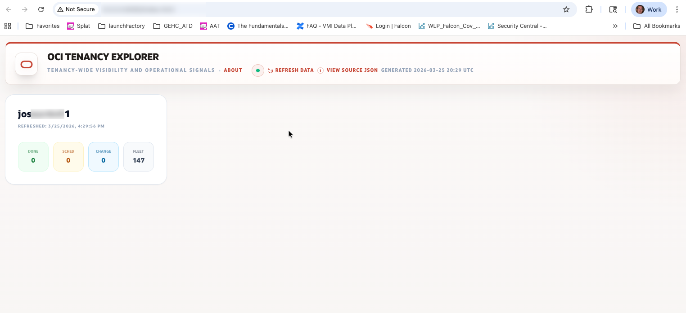
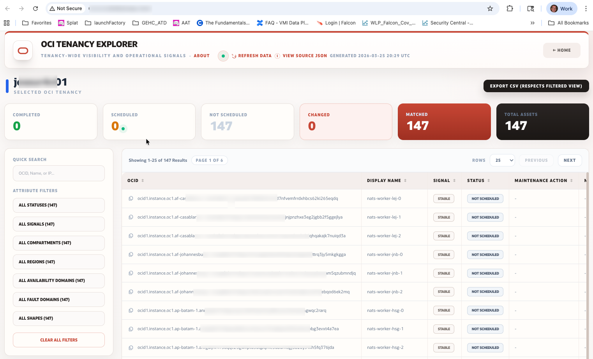

# OCI Tenancy Explorer

OCI Tenancy Explorer is a lightweight OCI operations portal for reviewing tenancy-wide inventory, maintenance signals, shape footprint, capability opportunities, and console announcements from one browser-based workspace.

## Purpose

This project helps a teammate answer practical questions such as:

- What does this tenancy look like right now?
- Which compute assets are currently in scope and where are they running?
- What changed since the last snapshot?
- Which OCI capabilities, operational signals, or announcements deserve follow-up?
- What more can I learn about a specific OCID without leaving the app?

The application is intentionally lightweight:

- `index.html` renders the dashboard
- Python collectors query OCI and write JSON snapshots
- `portal_server.py` serves the UI and exposes local refresh endpoints

OCI credentials stay on the host running the collectors and are never exposed to browser JavaScript.

If you are using Codex or another coding agent in this repo, start with [AGENTS.md](AGENTS.md). It captures the current local run model, OCI auth patterns, snapshot flow, feature toggles, and the expected path for adding new capabilities.

## Current App Surface

OCI Tenancy Explorer currently includes:

- `Tenancy Overview`
  A high-level summary of the tenancy, subscribed-region context, and estate-wide metrics.
- `Fleet View`
  The main asset grid with search, filters, CSV export, maintenance context, and change signals.
- `Shape Explorer`
  A compute shape inventory view for reviewing shape families, mix, and regional distribution.
- `Opportunities`
  Evidence-backed insights that highlight platform maturity signals and potential next conversations.
- `Console Announcements`
  A dedicated tab for OCI console announcements that can be refreshed into a meeting-friendly local snapshot.
- `Asset Inspector`
  An OCID drill-down experience that lets users click an OCID, inspect normalized resource details, and hand off to OCI Console / Cloud Shell.
- `Sync Data`
  A top-level workflow that refreshes all supported JSON snapshots sequentially and shows live progress in the refresh console.

## Project Components

- `build_fleet_data.py`
  Builds `fleet_data.json` for the main tenancy and fleet experience.
- `build_shape_data.py`
  Builds `fleet_data_shapes.json` for Shape Explorer.
- `build_opportunities_data.py`
  Builds `fleet_data_opportunities.json` for Opportunities.
- `build_announcements_data.py`
  Builds `fleet_data_announcements.json` for Console Announcements.
- `portal_server.py`
  Serves the app locally and exposes refresh/status endpoints used by the UI.
- `app_config.json`
  Controls app-level experimental feature flags under `experimental-features`, such as whether `Tenancy Overview`, `Shape Explorer`, `Opportunities`, and `Console Announcements` are visible in the UI and included in `Sync Data` where applicable.
- `oci_config.example`
  Example OCI SDK config.

## Preview

### Landing / Entry View



### Dashboard / Index View



## Quick Start (Direct)

1. Clone the repository:

```bash
git clone git@github.com:Architects-that-code/oci-tenancy-explorer.git
cd oci-tenancy-explorer
```

2. Install the OCI SDK:

```bash
python3 -m pip install oci
```

3. Start the portal:

```bash
python3 portal_server.py --profile DEFAULT
```

4. Open:

```text
http://127.0.0.1:8765/index.html
```

5. Use `Sync Data` to refresh the full app, or run individual refreshes from the tab-specific actions.

Notes:

- Configure OCI auth via `~/.oci/config` or use `--auth instance_principal` on an OCI host.
- The browser should be opened through `portal_server.py`, not directly from disk or an unrelated local static server.
- The app can load existing snapshot files if they are already present in the repo folder.

## Quick Start (Manual Snapshot Build)

If you want to prebuild snapshots before opening the app:

```bash
python3 build_fleet_data.py --profile DEFAULT --output fleet_data.json
python3 build_shape_data.py --profile DEFAULT --output fleet_data_shapes.json
python3 build_opportunities_data.py --profile DEFAULT --output fleet_data_opportunities.json
python3 build_announcements_data.py --profile DEFAULT --output fleet_data_announcements.json
python3 portal_server.py --profile DEFAULT
```

## Quick Start (Docker)

1. Clone the repository:

```bash
git clone git@github.com:Architects-that-code/oci-tenancy-explorer.git
cd oci-tenancy-explorer
```

2. Build and run:

```bash
docker build -t oci-tenancy-explorer .
docker run --rm -p 8765:8765 \
  -e OCI_AUTH=config \
  -e OCI_PROFILE=DEFAULT \
  -e OCI_CONFIG_FILE=/home/appuser/.oci/config \
  -v ~/.oci:/home/appuser/.oci:ro \
  -v ~/.ssh:/home/appuser/.ssh:ro \
  oci-tenancy-explorer
```

3. Open:

```text
http://127.0.0.1:8765/index.html
```

4. Docker Compose:

```bash
docker compose up --build
```

5. For OCI instance principal on an OCI host:

```bash
docker compose -f docker-compose.yml -f docker-compose.oci-instance-principal.yml up --build
```

## How The App Works

The application uses a snapshot model:

1. A Python collector reads OCI APIs.
2. The collector writes a JSON snapshot locally.
3. `index.html` loads the snapshot and renders the UI.

Current snapshots:

- `fleet_data.json`
- `fleet_data_shapes.json`
- `fleet_data_opportunities.json`
- `fleet_data_announcements.json`

### Sync Data

The `Sync Data` button runs the collectors sequentially in this order:

1. Fleet
2. Shape Explorer
3. Opportunities
4. Console Announcements

This keeps logs easier to follow and keeps OCI API load more controlled than a parallel batch refresh.

The refresh console shows:

- overall progress
- step activity
- per-region or per-step detail
- combined collector logs
- success, partial-success, or failure status

The header also shows the latest sync time in UTC so users can quickly judge data freshness.

## Asset Inspector And OCID Drill-Down

The app includes an OCID-centric drill-down flow:

- click an OCID in the grid or details panel to open the `Asset Inspector`
- search for an exact OCID from Fleet View
- inspect normalized details for supported resource types
- follow related OCIDs from one resource to another
- copy the OCID or a generated summary
- open OCI Console / Cloud Shell with a guided handoff

The current supported live lookup set focuses on high-value OCI resource types such as instances, VNICS, subnets, VCNs, volumes, boot volumes, and compartments.

## OCI Authentication

### Option 1: Local `~/.oci/config`

Use a local OCI config and API key when running from a workstation or laptop.

Example:

```ini
[DEFAULT]
user=ocid1.user.oc1..your_user_ocid_here
fingerprint=aa:bb:cc:dd:ee:ff:11:22:33:44:55:66:77:88:99:00
tenancy=ocid1.tenancy.oc1..your_tenancy_ocid_here
region=us-ashburn-1
key_file=/Users/user_name/.oci/oci_api_key.pem
```

Helpful references:

- [oci_config.example](oci_config.example)
- Oracle SDK config documentation

### Option 2: Instance Principals

Use instance principals when the app runs on an OCI compute instance.

Examples:

```bash
python3 portal_server.py --auth instance_principal
python3 build_fleet_data.py --auth instance_principal --output fleet_data.json
```

This is often the best long-term model for shared internal deployments because API keys do not need to be copied to user workstations.

## Operational Notes

- The UI must be served by `portal_server.py` for one-click refresh to work.
- Snapshot timestamps are shown in UTC for consistency across the app.
- `Fleet View` supports CSV export of the currently filtered results.
- `Shape Explorer`, `Opportunities`, and `Console Announcements` each have their own refresh flows in addition to `Sync Data`.
- The app is designed for one tenancy at a time, with tenancy-level visibility as the default operating model.
- If OCI Console shows a maintenance date for an instance but the portal does not, review the refresh warnings first. The collector attempts maintenance-event enrichment per compartment and falls back to instance summary data when the lookup fails, times out, or returns no maintenance event timing.

## Security Notes

- do not commit `~/.oci/config`
- do not commit private API keys
- prefer instance principals where practical for shared server-side deployments
- treat generated snapshot JSON as sensitive operational tenancy metadata
- place the app behind internal network controls or authenticated access when sharing with a wider audience

## Disclaimer (Sample Code)

ORACLE AND ITS AFFILIATES DO NOT PROVIDE ANY WARRANTY WHATSOEVER, EXPRESS OR IMPLIED, FOR ANY SOFTWARE, MATERIAL OR CONTENT OF ANY KIND CONTAINED OR PRODUCED WITHIN THIS REPOSITORY, AND IN PARTICULAR SPECIFICALLY DISCLAIM ANY AND ALL IMPLIED WARRANTIES OF TITLE, NON-INFRINGEMENT, MERCHANTABILITY, AND FITNESS FOR A PARTICULAR PURPOSE. FURTHERMORE, ORACLE AND ITS AFFILIATES DO NOT REPRESENT THAT ANY CUSTOMARY SECURITY REVIEW HAS BEEN PERFORMED WITH RESPECT TO ANY SOFTWARE, MATERIAL OR CONTENT CONTAINED OR PRODUCED WITHIN THIS REPOSITORY. IN ADDITION, AND WITHOUT LIMITING THE FOREGOING, THIRD PARTIES MAY HAVE POSTED SOFTWARE, MATERIAL OR CONTENT TO THIS REPOSITORY WITHOUT ANY REVIEW. USE AT YOUR OWN RISK.
